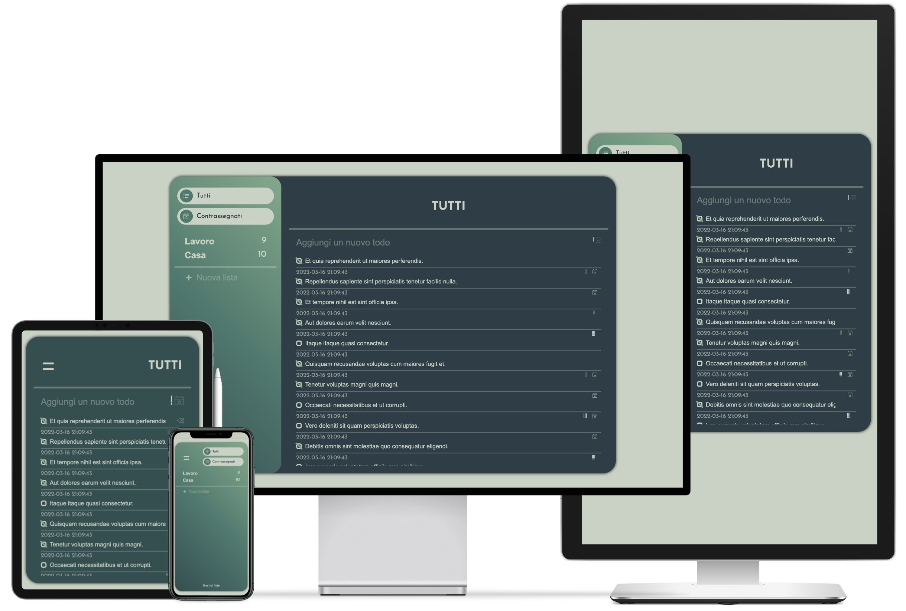

<p align="center">
 
</p>

<h2 align="center">Full-Stack ToDo List</h2>

---

<p align="center">Full-Stack ToDo list.</p>
<br>


<br>
<br>

## ⛏️ Built With <a name = "tech_stack"></a>

- [HTML](https://html.com) - Page Structure
- [SCSS](https://sass-lang.com) - Page Style
- [JavaScript](https://www.javascript.com/) - Front-End Logic
  - [Axios](https://github.com/axios/axios) - JS Library
- [VueJS](https://www.javascript.com/) - Front-End Framework
- [PHP](https://www.php.net) - Back-End Logic
- [Laravel](https://laravel.com) - Back-End Framework
- [MySQL](https://www.mysql.com/it/) - Database

## ✍️ Authors <a name = "authors"></a>

- [@IvanDF](https://github.com/IvanDF) - Design & Develop

See also my [website!](https://ivandf.dev)
New one is in progress.

<br />

---

<br />

## How to run

**Run from the root of the project folder**

First move to Back-End folder and create & configure DB connection:

```
$ - cd back-end/ && cp -R .env.example .env
```

Install the Back-End dependencies and generate the key for DB communication:

```
$ - composer install && php artisan key:generate
```

**OPTIONAL**
Migrate seeder to DB

```
$ - php artisan migrate:fresh --seed && php artisan serve
```

At the move to Front-End folter and run index.html:

```
$ - cd front-end && open ./index.html
```
